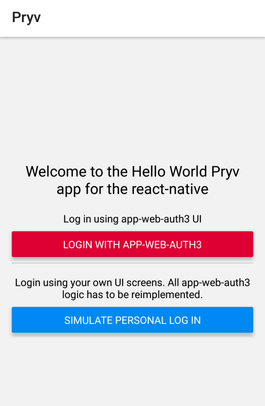
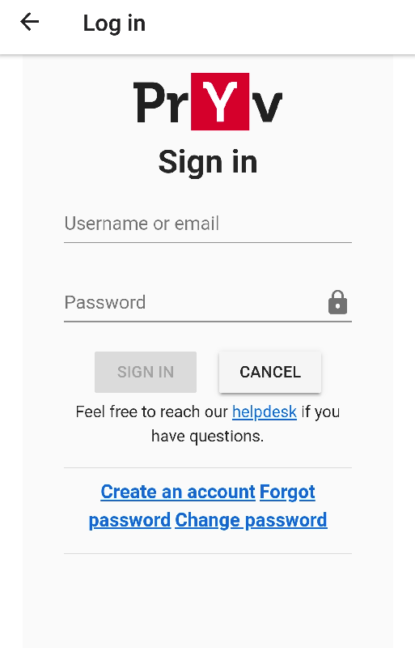
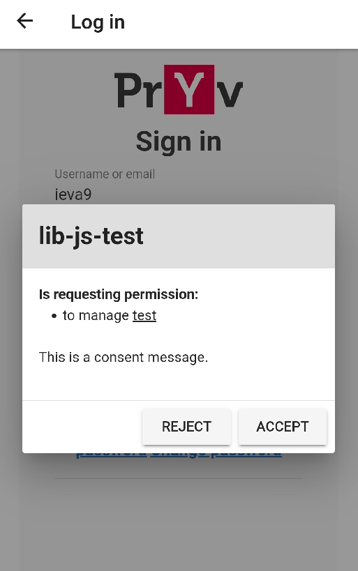

# React Native app example with lib-js

React native application using the [Pryv.io JavaScript library](https://github.com/pryv/lib-js).
This applications displays 2 implementations of the Pryv.io authentication process.

1. Login button that launches the [Pryv.io Authentication process](https://api.pryv.com/reference/#authenticate-your-app).
2. Personal login simulation

| Login selection | App-web-auth3 login | Consent | Dashboard |
| ------------------------------------------------------------ | ------------------------------------------------------------ | ------------------------------------------------------------ | ------------------------------------------------------------ |
|  |  |  |  |

## Getting started

If you have no local react-native environment setup, the quickest way to get up and running is to use a prepared docker container.  
To run this application with the [react-native-docker image](https://github.com/theanam/react-native-docker):

1. start the docker image:

```bash
docker run --rm -it -v `pwd`:/app --network host theanam/react-native bash
```

2. Install dependencies, run (in the `/app/PryvReactNative` directory inside the container):

```bash
yarn
```

3. Build the project, run (in the `/app/PryvReactNative` directory inside the container):

```bash
expo start (in /app/PryvReactNative directory)
```

4. Download the [expo app](https://expo.io/tools#client) on your mobile device

5. Using the expo app, you can scan the QR code to run the app (the mobile device has to be on the same network as the computer)

## Description

The application is based on [create-react-native-app](https://github.com/expo/create-react-native-app). 

You can check [./PryvReactNative/views/auth/login-method-selection.js](/PryvReactNative/views/auth/login-method-selection.js) for the Pryv.io authentication related code. As explained in the [lib-js README](https://github.com/pryv/lib-js), you need to do the following:

1. Import `pryv` library:

```javascript
const Pryv = require('pryv');
```

2. Initialize the `Pryv.Service` and custom `MyLoginButton` with the correct settings:

```javascript
async function initializePryvService () {
    console.log('initializePryvService');
    const authSettings = {
      authRequest: { // See: https://api.pryv.com/reference/#auth-request
        requestingAppId: 'lib-js-test',
        languageCode: 'fr', // optional (default english)
        requestedPermissions: [
          {
            streamId: 'test',
            defaultName: 'test',
            level: 'manage'
          }
        ],
        clientData: {
          'app-web-auth:description': {
            'type': 'note/txt', 'content': 'This is a consent message.'
          }
        },
        // referer: 'my test with lib-js', // optional string to track registration source
      }
    };
    // To avoid CORS problem in local environment we use json and not the url
    let serviceInfoUrl = null; // 'https://api.pryv.com/lib-js/demos/service-info.json';
    let serviceInfoJson = {
      "register": "https://reg.pryv.me",
      "access": "https://access.pryv.me/access",
      "api": "https://{username}.pryv.me/",
      "name": "Pryv Lab",
      "home": "https://www.pryv.com",
      "support": "https://pryv.com/helpdesk",
      "terms": "https://pryv.com/pryv-lab-terms-of-use/",
      "eventTypes": "https://api.pryv.com/event-types/flat.json",
      "assets": {
        "definitions": "https://pryv.github.io/assets-pryv.me/index.json"
      }
    };

    try {
      let authService = new Pryv.Service(serviceInfoUrl, serviceInfoJson);
      await authService.info()

      const loginBtn = new MyLoginButton(authSettings, authService);
      await loginBtn.init();

      setLoginButton(loginBtn);
      setPryvService(authService);
    } catch (e) {
      console.log('Error:', e);
    }
  };
```

3. Inside the `MyLoginButton` class, define the `onStateChange)` method as following:

```javascript
async onStateChange (state) {
  if (state.status !== authState.status) {
    console.log('State just changed to:', state.status);
    setAuthState(state);

    switch (state.status) {
      case Pryv.Browser.AuthStates.LOADING:
        console.log(this.auth.messages.LOADING);
        break;
      case Pryv.Browser.AuthStates.INITIALIZED:
        console.log(this.auth.messages.LOGIN + ': ' + this.serviceInfo.name);
        break;
      case Pryv.Browser.AuthStates.NEED_SIGNIN:
        startLoginScreen(state.authUrl);
        break;
      case Pryv.Browser.AuthStates.AUTHORIZED:
        console.log(state.username);
        this.saveAuthorizationData({
          apiEndpoint: state.apiEndpoint,
          username: state.username
        });
        break;
      case Pryv.Browser.AuthStates.SIGNOUT:
        this.deleteAuthorizationData();
        this.auth.init();
        break;
      case Pryv.Browser.AuthStates.ERROR:
        console.log('Error', authState.error);
        navigation.navigate('NotLoggedIn');
        Alert.alert(
          "Error",
          this.auth.messages.ERROR + ': ' + state.message,
          [
            {
              text: "Cancel",
              style: "cancel"
            },
          ],
          { cancelable: true }
        );
        break;
      default:
        console.log('WARNING Unhandled state for Login: ' + state.status);
    }
  }
}
```

4. When the user clicks on the login button, the application should start the auth process and redirect to the URL that is received from the [auth request](https://api.pryv.com/reference/#auth-request) as shown in the example below:

```javascript
const startLoginScreen = (loginUrl) => {
  console.log('startLoginScreen');
  return navigation.navigate('AppWebAuth3', {
    url: loginUrl
  });
}
```

5. When `state.status` is equal to `Pryv.Browser.AuthStates.AUTHORIZED`, you can save the `apiEndpoint` containing the token from the `state` as shown below:

```javascript
case Pryv.Browser.AuthStates.AUTHORIZED:
  console.log(state.username);
  this.saveAuthorizationData({
    apiEndpoint: state.apiEndpoint,
    username: state.username
  });
	break;
```

### Personal login

As shown in the [./PryvReactNative/views/auth/login.js](/PryvReactNative/views/auth/login.js), to perform a direct login call you can use `pryvService.login()` method for authentication.

```javascript
const connection = await pryvService.login(username, password, appId);
const token = connection.token;
```

### Enjoy!

## License

[Revised BSD license](https://github.com/pryv/documents/blob/master/license-bsd-revised.md)
